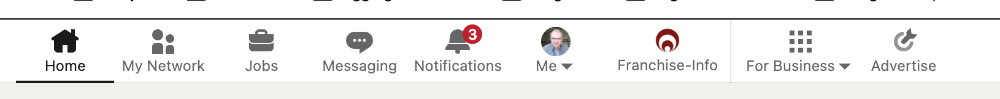
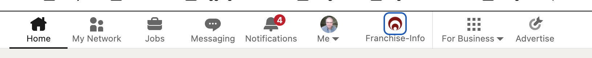

# LinkedIn Page Monitor

LinkedIn Page Monitor is a Chrome/Edge productivity extension being developed to support our agency's LinkedIn employee advocacy programs for franchise clients.

The extension gives authorized Company Page administrators persistent access to the Company Page they manage from LinkedIn's top navigation and provides a visual indicator when relevant Company Page activity requires attention.

Version 1.3 is a working proof-of-concept configured for Franchise-Info LLC. We are seeking access to LinkedIn's Community Management API so the production implementation can use LinkedIn's authorized APIs for permitted Company Page and community activity.

## Current purpose

We develop LinkedIn employee advocacy programs for franchise organizations. These programs help employees, franchisees, executives, and other brand advocates curate and repost appropriate Company Page content and participate in the conversations generated by that content.

Managing these programs requires agency and client administrators to monitor Company Page activity and identify conversations that may require attention. LinkedIn Page Monitor is being developed to make the Company Page and relevant community activity more visible to those administrators.

Version 1.3 validates the initial user experience before integration with LinkedIn's Community Management API.

## Current capabilities

Adds the Franchise-Info Company Page brand icon to LinkedIn's top navigation.
Provides direct access to the Franchise-Info posts feed.
Identifies new Company Page activity in the prototype.
Changes the visual state of the brand icon when unseen activity is detected.
Recognizes original Company Page posts and relevant repost activity.
Preserves notification state as the user navigates LinkedIn.
Provides diagnostic information for development and testing.

## User interface

Normal state — persistent Company Page shortcut

New activity state — Company Page icon highlighted

The Company Page brand icon provides direct access to the Page. When relevant unseen activity is detected, the icon changes visual state so the administrator knows there is activity requiring review.

)

## Installation for local/client testing

1.  Download or clone this repository.
2.  Open `chrome://extensions` in Chrome or Edge's equivalent extensions
    page.
3.  Turn on **Developer mode**.
4.  Click **Load unpacked**.
5.  Select the repository folder containing `manifest.json`.
6.  Open or refresh LinkedIn.

When updating a locally loaded copy, replace the files, use **Reload**
on the extensions page, and refresh LinkedIn.

## How to use it

Use LinkedIn normally. The Franchise-Info control appears in the top
navigation.

-   **Normal logo:** no unseen activity is currently flagged.
-   **Blue outline:** LinkedIn Page Monitor has detected new
    Franchise-Info activity.
-   **Hover:** shows the monitor's current diagnostic state.
-   **Click:** opens the Franchise-Info posts feed and clears the
    current notification state.

## Prototype and Community Management API integration

Version 1.3 is a proof-of-concept and does not currently use LinkedIn's Community Management API.

The prototype validates the user interface and activity-monitoring workflow using LinkedIn content available to the signed-in user. It currently uses rendered-page detection and a secondary background check to identify activity.

We are requesting Community Management API access so that the production implementation can replace these prototype detection mechanisms, where supported by LinkedIn's APIs, with authorized API access to permitted Company Page and community activity.

The intended production implementation will use LinkedIn authentication, authorization, and Community Management API permissions to limit access to organizations and activity the authenticated user is authorized to manage.

Detailed information about the prototype detection implementation is maintained in DEVELOPMENT.md.

## Prototype limitations

Version 1.3 is currently configured specifically for Franchise-Info LLC.
Version 1.3 is a proof-of-concept and does not yet use the Community Management API.
Prototype activity detection depends on LinkedIn's rendered web experience and therefore is not intended to be the long-term production data-access mechanism.
The production implementation is intended to use authorized Community Management API functionality where available.
Final functionality will be limited to the LinkedIn APIs, permissions, and use cases approved for the application.
The extension does not automate LinkedIn engagement actions.

## Current monitored page

`https://www.linkedin.com/company/franchise-info-sponsored/posts/?feedView=all&viewAsMember=true`

    
## Community Management API access requested

We are requesting Community Management API access to support our agency's employee advocacy work for franchise clients.

The initial integration is intended to:

Identify Company Pages the authenticated user is authorized to administer.
Retrieve permitted Company Page and community activity required to support the monitoring workflow.
Use that authorized activity data to determine when the Company Page indicator should alert the administrator to activity requiring review.

LinkedIn Page Monitor will not use API access to automate likes, comments, reposts, or other member engagement.

## LinkedIn reviewer testing

This repository contains the current proof-of-concept Chrome/Edge extension.

No separate product username or password is required. The extension operates in conjunction with the user's authenticated LinkedIn session.

Installation
Download or clone this repository.
Open chrome://extensions.
Enable Developer mode.
Select Load unpacked.
Select the directory containing manifest.json.
Open or refresh LinkedIn.

The Franchise-Info brand icon will appear in the LinkedIn navigation for the current prototype.

## Repository documentation

-   `CHANGELOG.md` --- release history.
-   `DEVELOPMENT.md` --- architecture, implementation knowledge,
    selectors, failure modes, and debugging notes.
-   `ROADMAP.md` --- current testing objective and unanswered product
    questions.

## Version

Current client-test version: **1.3.0**
